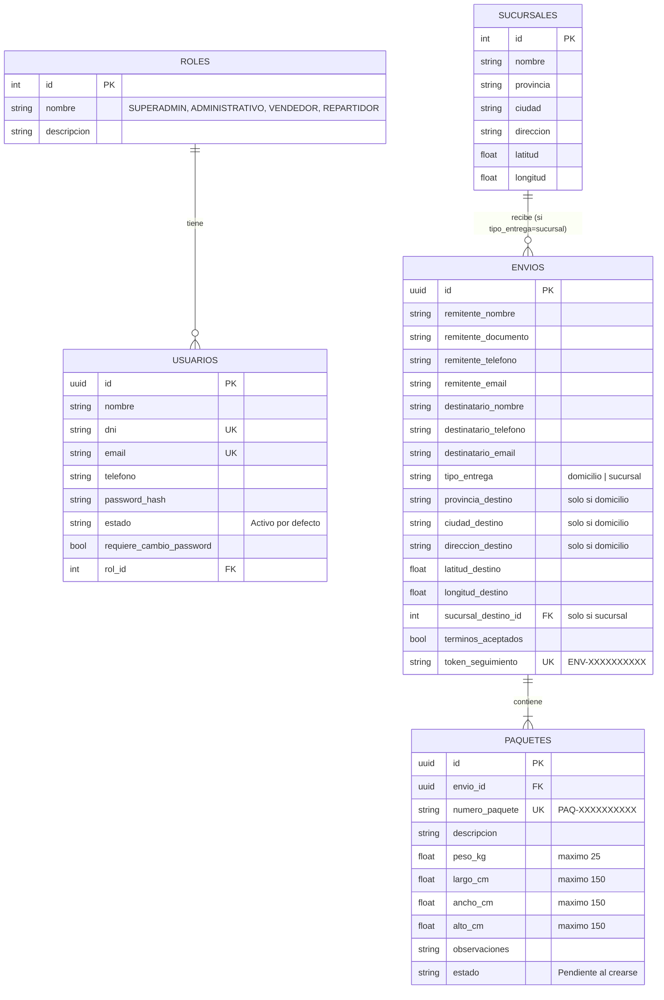

# Modelo de datos

Definido en `app/infrastructure/db/models.py` con SQLAlchemy 2.0 (mapeo declarativo con `Mapped[...]`). En desarrollo corre sobre SQLite (`sqlite+aiosqlite`); el esquema es compatible con PostgreSQL sin cambios de modelo, salvo el tipo UUID nativo (ver nota al final).

## Diagrama

## Notas por tabla

### `roles` / `usuarios` (HU01 / HU02)

- `roles` se siembra una única vez al iniciar la app (`infrastructure/db/seed.py:sembrar_roles`), con IDs fijos definidos en `domain/constants/roles.py:RolIdEnum` (1=SUPERADMIN, 2=ADMINISTRATIVO, 3=VENDEDOR, 4=REPARTIDOR). No hay endpoint para crear ni modificar roles.
- `usuarios.dni` y `usuarios.email` tienen constraint `UNIQUE` — es la base de la validación de duplicados de HU01 Escenario 4.
- `requiere_cambio_password` nace en `True` para todo empleado dado de alta por `POST /admin/empleados`, y en `False` para el Superadministrador sembrado por `sembrar_superadmin` (no le aplica el flujo de primer acceso de HU02).
- La relación `usuarios.rol` se carga siempre (`lazy="joined"`) porque casi todo flujo de autenticación necesita el nombre del rol.

### `sucursales` (soporte de HU03 y futura HU09)

- Se siembran 6 sucursales de ejemplo al iniciar la app (`sembrar_sucursales`), sin endpoint de alta — es un catálogo de solo lectura desde la API pública.

### `envios` / `paquetes` (HU03 / HU04)

- Un `Envio` es la unidad de la relación remitente-destinatario-destino; puede contener uno o más `Paquete`. El `token_seguimiento` vive en `Envio`, no en `Paquete`: **un token siempre corresponde a todos los paquetes de un mismo envío** (HU04, Escenario 2).
- `tipo_entrega` decide qué bloque de columnas de destino aplica: si es `"domicilio"`, se completan `provincia_destino`/`ciudad_destino`/`direccion_destino` (y opcionalmente lat/long si el usuario marcó un punto en el mapa); si es `"sucursal"`, se completa `sucursal_destino_id` y los campos de domicilio quedan en `NULL`. Esta exclusión mutua se valida a nivel de contrato (`contracts/envios.py`), no con una constraint SQL — ver [HU03](../04-historias-de-usuario/hu03-registro-envios.md).
- `paquetes.numero_paquete` es único por paquete (para el código de barras de la planilla); `envios.token_seguimiento` es único por envío. Ambos se generan con el mismo esquema (`domain/rules/codigos_rules.py`) pero con prefijos distintos (`ENV-` / `PAQ-`).
- `paquetes.estado` solo tiene el valor `"Pendiente"` en esta etapa del proyecto (recién registrado). Las transiciones de estado (en tránsito, entregado, etc.) quedan para cuando se implementen HU06/HU10/HU11/HU12/HU13.
- Los `cascade="all, delete-orphan"` en `Envio.paquetes` significa que si algún día se borra un envío, sus paquetes se borran con él — hoy no existe ningún endpoint de borrado, es solo la regla de integridad del modelo.

## Nota sobre UUID en SQLite vs. PostgreSQL

Los IDs de `usuarios`, `envios` y `paquetes` usan `sqlalchemy.types.Uuid(as_uuid=True)`, un tipo "portable" de SQLAlchemy 2.0: en SQLite se almacena como texto y en PostgreSQL usa el tipo `UUID` nativo. No requiere cambios de modelo al migrar de motor, solo la variable `DATABASE_URL` (ver [Variables de entorno](../02-configuracion/variables-de-entorno.md)).

## Migraciones

El proyecto tiene Alembic scaffolded (`app/infrastructure/db/migrations/`) pero **todavía sin ninguna migración generada** (`versions/` solo tiene un `.gitkeep`). En desarrollo, las tablas se crean automáticamente al iniciar la app con `Base.metadata.create_all` (`infrastructure/db/session.py:crear_tablas`, llamado desde `seed.py:ejecutar_siembra` en el `lifespan` de `api/main.py`). Esto es válido para SQLite local, pero antes de usar PostgreSQL en un ambiente compartido hay que generar la migración inicial con `alembic revision --autogenerate` y dejar de depender de `create_all`.