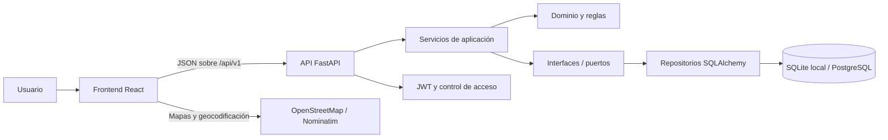

# Arquitectura general del proyecto

## 1. Propósito y alcance

El repositorio contiene una aplicación para registrar, administrar y consultar envíos. La solución está organizada como un monorepo con tres áreas principales:

- `front/`: aplicación web construida con React, TypeScript y Vite.
- `Back/`: API REST construida con FastAPI y persistencia asíncrona mediante SQLAlchemy.
- `knowledge/`: decisiones funcionales y técnicas compartidas por todo el equipo.

La arquitectura actual cubre los flujos del primer sprint: autenticación, cambio obligatorio de contraseña, inicio de sesión mediante token, administración básica de empleados, registro público de envíos, generación de etiquetas y seguimiento público por token.

## 2. Vista de alto nivel



La comunicación entre frontend y backend se realiza mediante HTTP y JSON. El frontend nunca accede directamente a la base de datos y los componentes visuales no construyen solicitudes HTTP por sí mismos.

## 3. Arquitectura del frontend

### 3.1. Composición principal

El punto de entrada monta, en este orden conceptual:

1. El store de Redux Toolkit.
2. El cliente de TanStack Query.
3. La restauración y validación de la sesión.
4. El router de la aplicación.

`App.tsx` actúa como raíz de composición y `AppRouter.tsx` coordina los grupos de rutas:

- `AuthRoutes.tsx`: rutas públicas, tanto de autenticación como operativas.
- `MainRoutes.tsx`: rutas privadas de la aplicación.
- `ProtectedRoutes.tsx`: validación de autenticación, cambio obligatorio de contraseña y autorización por rol.

Después de iniciar sesión, todos los perfiles ingresan a `home`. Desde allí se muestran únicamente los módulos habilitados para su rol. La misma configuración de navegación alimenta los accesos rápidos, la barra lateral y las validaciones de ruta para evitar criterios duplicados.

### 3.2. Organización por funcionalidades

El código se agrupa por dominio en `src/features/<feature>/`:

```text
src/
├── app/                 # Store y configuración transversal
├── features/
│   ├── auth/            # Login, sesión y cambio de contraseña
│   ├── home/            # Entrada privada y accesos rápidos
│   ├── shipments/       # Registro público de envíos
│   ├── tracking/        # Seguimiento público
│   └── users/           # Administración de empleados
├── layouts/             # Estructura visual privada
├── router/              # Definición y protección de rutas
├── shared/              # Elementos reutilizables
└── styles/              # Tokens y estilos globales
```

Cada funcionalidad mantiene cerca sus páginas, componentes, hooks, servicios y tipos. El flujo normal de una operación remota es:

```text
Página o componente → hook de la feature → TanStack Query → servicio HTTP → API
```

### 3.3. Estado y acceso remoto

- **Redux Toolkit** conserva estado global del cliente que debe sobrevivir entre pantallas, principalmente la sesión.
- **TanStack Query** administra datos remotos, estados de carga, errores, caché e invalidaciones.
- Las respuestas completas del servidor no se duplican en Redux.
- Los servicios construyen sus URLs desde `VITE_API_URL` y mantienen el acceso HTTP fuera de la UI.
- Los tipos de transporte conservan `snake_case`; los modelos usados por la interfaz se transforman a `camelCase`.

### 3.4. Sesión y autorización

El login recibe DNI y contraseña. El token y los datos mínimos del usuario se conservan localmente para restaurar la sesión al recargar, pero se validan contra `/api/v1/auth/login-token` antes de considerar la sesión activa.

Los tokens con alcance limitado obligan a pasar por el cambio de contraseña. El frontend oculta las opciones no disponibles para el rol y evita navegar a ellas, mientras que el backend vuelve a comprobar los permisos. La autorización del servidor es siempre la fuente de verdad.

El cierre de sesión es local: elimina la sesión persistida, limpia Redux y descarta la caché remota. En este sprint no existe revocación de token en el servidor.

### 3.5. Experiencia visual

- La identidad se centraliza en `src/styles/theme.css`, con variantes clara y oscura.
- Los controles y acciones utilizan `lucide-react` como única librería de iconos.
- El layout privado dispone de navegación lateral permanente en escritorio, colapsable por debajo de 968 px y de pantalla completa en móviles pequeños.
- Se mantienen labels asociados, foco visible, estados de carga y mensajes accesibles desde 320 px de ancho.
- Las funcionalidades de mayor peso se cargan por ruta para no penalizar la entrada inicial.

### 3.6. Funcionalidades públicas de logística

El registro y el seguimiento de envíos no requieren sesión:

- El registro separa los datos del remitente y destinatario, permite elegir entrega a domicilio o sucursal y admite varios paquetes.
- Leaflet presenta mapas basados en OpenStreetMap.
- Nominatim geocodifica una dirección ingresada explícitamente y utiliza la ciudad como alternativa cuando no encuentra la calle y altura.
- Las sucursales se consultan desde la API y se representan en el mapa.
- La etiqueta se genera en el navegador con código de barras Code 128 y puede imprimirse o descargarse como PDF.
- El seguimiento consulta un token público y muestra el estado y la secuencia temporal de cada paquete, sin exponer información personal.

## 4. Arquitectura del backend

### 4.1. Capas y dirección de dependencias

El backend aplica una arquitectura por capas con puertos y adaptadores:

```text
app/
├── api/                 # FastAPI, routers, middleware y composición
├── application/
│   ├── interfaces/      # Puertos de servicios y repositorios
│   └── services/        # Casos de uso
├── contracts/           # DTO y validaciones Pydantic
├── domain/
│   ├── constants/       # Roles, alcances y códigos
│   ├── entities/        # Entidades del negocio
│   └── rules/           # Reglas puras del dominio
├── infrastructure/
│   ├── auth/            # JWT y hashing
│   ├── db/              # Modelos, sesiones, seed y migraciones
│   └── repositories/    # Adaptadores SQLAlchemy
└── core/                # Configuración, errores y logging
```

Las dependencias apuntan hacia el dominio: los casos de uso conocen interfaces, no implementaciones concretas. `app/api/dependencies.py` funciona como raíz de composición y conecta servicios con repositorios y utilidades de infraestructura mediante `Depends` de FastAPI.

Los contratos de importación se verifican con `import-linter`: dominio y aplicación no deben depender de API ni infraestructura.

### 4.2. API y contratos

- La API está versionada bajo `/api/v1`.
- Los routers traducen HTTP a llamadas de casos de uso y no contienen lógica central del negocio.
- Pydantic v2 valida entradas y serializa respuestas.
- Los errores controlados siguen un formato uniforme con `status`, `code`, `message` y, cuando corresponde, errores por campo.
- Un manejador global evita exponer detalles internos ante errores inesperados.
- Cada solicitud recibe un correlation ID para facilitar la trazabilidad en logs.
- OpenAPI, Swagger y ReDoc se generan desde los contratos de FastAPI.

### 4.3. Persistencia

- SQLAlchemy 2 trabaja con sesiones asíncronas y aplica rollback cuando una operación falla.
- Los repositorios implementan interfaces de la capa de aplicación, aislando consultas y modelos de persistencia.
- SQLite permite levantar el entorno local sin infraestructura adicional.
- El uso de drivers asíncronos y configuración por `DATABASE_URL` deja preparado el despliegue con PostgreSQL.
- Alembic está incorporado para cambios versionados de esquema.
- Durante la inicialización local se ejecuta una siembra idempotente de datos base, incluidos roles y el usuario administrador configurado.

### 4.4. Seguridad

- Las contraseñas se almacenan con hash bcrypt; nunca se persisten en texto plano. La contraseña temporal se retorna una única vez al crear un empleado.
- Los JWT incluyen identidad, rol, alcance, fecha de emisión y expiración.
- El token temporal de cambio de contraseña tiene menor duración y alcance `password_reset_only`; el token operativo utiliza `full_access`.
- Las dependencias de seguridad comprueban firma, expiración, alcance, usuario activo y rol requerido.
- Las rutas administrativas permanecen protegidas aunque el frontend oculte sus accesos.
- El seguimiento utiliza tokens no secuenciales y devuelve sólo la información logística necesaria.

### 4.5. Reglas de negocio

Las validaciones que representan decisiones del negocio —política de contraseñas, generación de códigos y reglas de paquetes— se mantienen en `domain/rules`. Esto permite probarlas sin iniciar FastAPI ni una base de datos y evita que queden dispersas en routers o modelos ORM.

## 5. Flujos principales

| Flujo | Acceso | Endpoint principal | Responsabilidad del frontend | Responsabilidad del backend |
| --- | --- | --- | --- | --- |
| Login | Público | `POST /api/v1/auth/login` | Capturar DNI y contraseña, guardar sesión | Validar credenciales y emitir token con alcance adecuado |
| Restaurar sesión | Token almacenado | `POST /api/v1/auth/login-token` | Bloquear rutas privadas hasta validar | Verificar token, usuario y estado de la cuenta |
| Cambiar contraseña | Token temporal | `POST /api/v1/auth/cambiar-password` | Validar confirmación y reemplazar sesión | Aplicar política, actualizar hash y emitir token operativo |
| Crear empleado | Superadministrador | `POST /api/v1/admin/empleados` | Cargar roles y presentar formulario | Validar permisos, unicidad y generar contraseña temporal |
| Registrar envío | Público | `POST /api/v1/envios` | Reunir datos, mapa, paquetes y generar planilla | Validar y persistir envío y paquetes; emitir token de seguimiento |
| Listar sucursales | Público | `GET /api/v1/sucursales` | Mostrar opciones y marcadores | Entregar ubicaciones disponibles |
| Seguimiento | Público por token | `GET /api/v1/seguimiento/{token}` | Mostrar resumen y estados por paquete | Resolver token y limitar la información expuesta |

## 6. Decisiones técnicas principales

### Frontend

1. **Arquitectura por feature:** reduce el acoplamiento entre dominios y permite que cada módulo evolucione con sus propios tipos, hooks y servicios.
2. **Redux para cliente y TanStack Query para servidor:** evita mezclar sesión y preferencias con datos remotos o duplicar cachés.
3. **Rutas públicas y privadas separadas:** hace explícito el límite de seguridad y centraliza las reglas en `ProtectedRoutes`.
4. **Home común después del login:** todos los roles tienen una entrada consistente; la navegación se adapta a permisos en vez de redirigir a un módulo arbitrario.
5. **Validación de sesión en el arranque:** un token almacenado no se considera válido sin confirmación del backend.
6. **Contratos API aislados:** `snake_case` queda en la frontera HTTP y la aplicación trabaja en `camelCase`.
7. **Diseño basado en tokens:** colores, espacios, superficies y temas se definen una vez y se reutilizan.
8. **Mapas abiertos:** Leaflet y OpenStreetMap evitan depender inicialmente de una plataforma propietaria; Nominatim se usa sólo ante una acción explícita.
9. **Documentos en el cliente:** código de barras, impresión y PDF no requieren un endpoint adicional durante el primer sprint.
10. **Seguimiento público por URL:** el token puede ingresarse o compartirse como parámetro, manteniendo fuera de la respuesta los datos personales.

### Backend

1. **FastAPI asíncrono:** ofrece contratos OpenAPI, validación tipada y buen encaje con operaciones de base de datos no bloqueantes.
2. **Capas con inversión de dependencias:** los casos de uso dependen de interfaces y el detalle de SQLAlchemy queda reemplazable.
3. **Inyección de dependencias:** la composición de servicios, repositorios y seguridad se concentra en un punto comprobable.
4. **Contratos Pydantic separados del ORM:** evita convertir los modelos de base de datos en el contrato público de la API.
5. **Repositorios por agregado funcional:** encapsulan persistencia y transacciones sin trasladar SQL a los routers.
6. **JWT con alcances:** diferencia una sesión operativa de una sesión restringida al cambio de contraseña.
7. **Autorización redundante y segura:** la interfaz mejora la experiencia ocultando módulos, pero el backend decide el acceso real.
8. **Errores normalizados:** frontend y logs pueden distinguir validación, duplicados, autenticación, permisos y recursos ausentes.
9. **Persistencia configurable:** SQLite simplifica desarrollo y PostgreSQL queda como objetivo natural para ambientes compartidos.
10. **Reglas puras de dominio:** las decisiones de negocio pueden probarse sin framework ni infraestructura.
11. **Observabilidad básica:** logging y correlation ID permiten rastrear una solicitud entre errores y operaciones.
12. **Guardas arquitectónicas automáticas:** Ruff, pytest e import-linter protegen estilo, comportamiento y dirección de dependencias.

## 7. Límites actuales y evolución prevista

Estas decisiones son válidas para el alcance actual, pero no deben confundirse con el estado final de producción:

- El JWT se conserva en almacenamiento del navegador. Una evolución posible es usar cookies `HttpOnly`, access tokens breves y refresh tokens rotativos.
- El cierre de sesión no revoca tokens. Si se necesita invalidación inmediata, será necesario registrar sesiones o versiones de token en el backend.
- CORS está abierto para facilitar el desarrollo local; en ambientes desplegados debe limitarse a los orígenes conocidos.
- La geocodificación consulta Nominatim desde el navegador. Para más volumen conviene incorporar caché, límites de uso o un proveedor/servicio intermedio acorde con su política.
- La ubicación en tiempo real, la ruta del repartidor y el mapa de tránsito no forman parte de este sprint.
- La creación automática de tablas resulta útil localmente; en ambientes compartidos los cambios de esquema deben ejecutarse exclusivamente mediante migraciones Alembic controladas.
- Los nombres de roles que interpreta el frontend deben mantenerse alineados con el catálogo del backend; a futuro puede formalizarse una matriz de permisos basada en capacidades en lugar de strings de rol.

## 8. Criterios de verificación

- Frontend: `npm run lint` y `npm run build` desde `front/`.
- Backend: `.venv/Scripts/python.exe -m pip check` y `.venv/Scripts/python.exe -m pytest -q` desde `Back/`.
- Arquitectura backend: ejecutar también los contratos de `import-linter` cuando se modifiquen dependencias entre capas.

